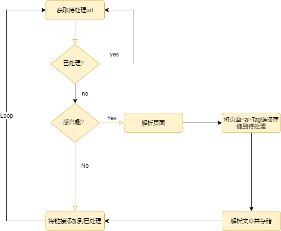

# Java实现的爬虫程序

## Requirements
Maven 3、JDK 1.8、Mysql 5.7、ElasticSearch 7.8.

## Usage
### 数据库
安装Mysql数据库，创建`news` database。

使用`flyway:migrate`构建表结构和初始化。

安装ElasticSearch并默认9200端口。

### 程序入口
com.hao.Main中的main方法。

### 使用Es搜索
索引Mysql中爬取的数据`com.hao.IndexData main()`
运行`com.hao.SearchUseCommand main()` 开始在命令行中搜索。

## 程序算法

